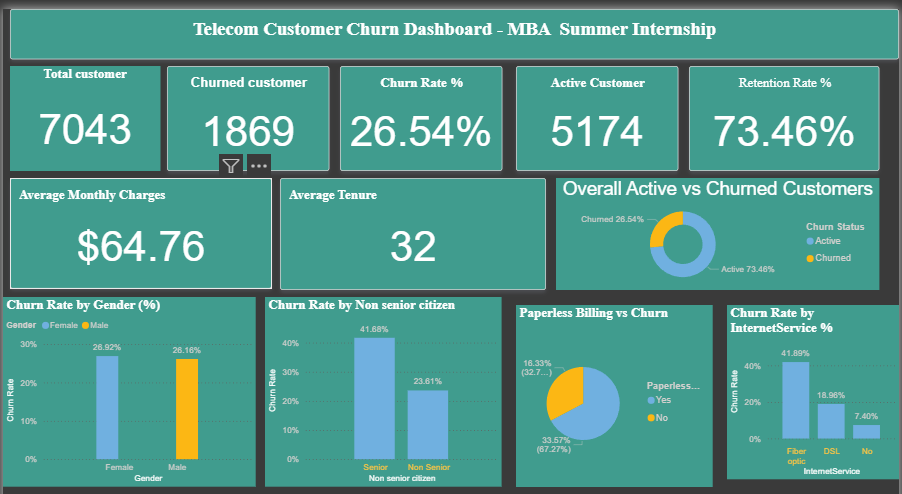

# 📊 Customer Churn Analysis & Prediction
An end-to-end telecom analytics project using **Python, Machine Learning, and Power BI** to identify churn drivers, predict customers at risk of leaving, and generate actionable customer-retention insights.

## 📌 Project Overview

Customer churn is a major challenge for subscription-based businesses. This project analyzes telecom customer data to understand the factors associated with customer churn and uses a Machine Learning model to identify customers who may be at risk of churning.

The project combines **Python-based data analysis and churn prediction** with an interactive **Power BI dashboard** for business-focused insights.

## 🎯 Business Problem

Telecom companies face revenue loss when customers discontinue their services. 
The objective of this project is to understand the key factors associated with churn,
identify high-risk customer segments, and support data-driven retention strategies.

## 🎯 Objectives

### Business Objectives
- Identify key factors associated with customer churn.
- Understand high-risk customer segments.
- Generate insights to support customer retention strategies.
- Provide an interactive dashboard for business decision-making.

### Technical Objectives
- Clean and preprocess telecom customer data.
- Apply feature engineering and one-hot encoding.
- Develop an ANN-based churn prediction model.
- Evaluate model performance using classification metrics.

## 🗂️ Dataset

The project uses a telecom customer churn dataset containing **7,043 customer records and 21 variables**.

**Target Variable:** Churn

The dataset includes information related to:

- Customer demographics
- Tenure
- Contract type
- Internet service
- Payment method
- Monthly charges
- Total charges
- Customer churn status

## 🛠️ Tools & Technologies

**Programming & Analysis**
- Python
- Pandas
- NumPy

**Visualization**
- Matplotlib
- Seaborn
- Power BI

**Machine Learning**
- Scikit-learn
- TensorFlow / Keras
- Artificial Neural Network (ANN)

**Environment**
- Jupyter Notebook
- Google Colab
  
## 🔍 Project Workflow

### 1. Data Collection
Collected the telecom customer dataset containing customer demographics, account information, subscribed services, billing details, tenure, and churn status.

### 2. Data Exploration
Performed an initial analysis of the dataset to understand its structure, variables, data types, missing values, and overall customer distribution.

### 3. Data Cleaning & Preprocessing
Handled missing values and prepared the dataset for analysis and machine learning. Categorical variables were encoded, and numerical features were appropriately prepared for model training.

### 4. Exploratory Data Analysis (EDA)
Analyzed customer behavior and churn patterns using statistical analysis and visualizations. Examined relationships between churn and factors such as tenure, services, billing methods, gender, and customer characteristics.

### 5. Feature Engineering
Selected and transformed relevant customer attributes into suitable features for the churn prediction model. Applied scaling and encoding techniques to improve model compatibility.

### 6. ANN Model Development
Developed an Artificial Neural Network (ANN) model using TensorFlow/Keras to predict whether a customer is likely to churn.

### 7. Model Training & Evaluation
Trained the ANN model and evaluated its performance using **Accuracy, Precision, Recall, and F1-Score** to understand how effectively the model identifies potential churn customers.

### 8. Power BI Dashboard Development
Created an interactive Power BI dashboard to present customer churn patterns, key performance indicators, and customer segments through charts and visualizations.

### 9. Business Insights & Recommendations
Interpreted the analysis and model results to identify important churn drivers and provide actionable recommendations that can help businesses improve customer retention.

## 🤖 Model Performance & Interpretation

The Artificial Neural Network (ANN) model was trained to predict customer churn based on customer demographics, services, account information, billing details, and tenure.

### 📊 Model Performance

| Metric | Score |
|---|---:|
| **Accuracy** | **77.73%** |
| **Precision** | **57.59%** |
| **Recall** | **50.37%** |
| **F1-Score** | **53.74%** |

### 🔎 Model Interpretation

- **Accuracy (77.73%)** – The model correctly predicts the churn status for approximately 78% of customers.
- **Precision (57.59%)** – Among customers predicted as likely to churn, approximately 58% actually churned.
- **Recall (50.37%)** – The model identified approximately half of the customers who actually churned.
- **F1-Score (53.74%)** – Provides a balance between precision and recall and indicates the model has moderate performance in identifying churn customers.

### 💼 Business Interpretation

The model can be used as a supporting tool to identify customers who may be at risk of churn. Since customer retention is the primary business objective, improving **recall** would be particularly valuable because identifying more actual churn-risk customers can help the business take preventive retention actions.


## 🎥 Project Demo

### Customer Churn Analysis & Prediction

A complete demonstration of the data preprocessing, ANN model,
prediction workflow, and Power BI dashboard.

https://github.com/user-attachments/assets/427e0509-3526-4652-9286-eb897ac63f5a

*Interactive project demonstration — click ▶ to play*


## 📊 Power BI Dashboard

The Power BI dashboard provides an interactive view of customer churn and retention.

### Key KPIs

- **Total Customers:** 7,043
- **Churned Customers:** 1,869
- **Active Customers:** 5,174
- **Churn Rate:** 26.54%
- **Retention Rate:** 73.46%
- **Average Monthly Charges:** $64.76
- **Average Tenure:** 32 months

### Dashboard Analysis

The interactive Power BI dashboard provides:

- Customer and churn KPIs
- Churn-rate analysis across customer segments
- Churn patterns by internet service
- Analysis by billing and payment characteristics
- Customer demographic comparisons
- Interactive filtering for deeper exploration



## 💡 Key Insights

- Overall customer churn rate is **26.54%**.
- **1,869 of 7,043 customers** are classified as churned.
- Customers with shorter tenure represent an important churn-risk segment.
- Service and billing characteristics show noticeable differences in churn behavior.
- The dashboard enables segmentation of customers to support targeted retention strategies.

  ## 📌 Business Recommendations

Based on the analysis, telecom businesses can:

- Prioritize retention campaigns for high-risk customer segments.
- Monitor customers with short tenure more closely.
- Use service and billing behavior to personalize retention offers.
- Combine churn predictions with customer-value information to prioritize interventions.
- Monitor churn KPIs regularly through the Power BI dashboard.


## 📁 Repository Structure

```text
customer-churn-analysis/
│
├── data/
│   └── TelecomCustomerChurn.csv
│
├── python/
│   └── customer_churn_prediction.ipynb
│
├── powerbi/
│   └── customer_churn_dashboard.pbix
│
├── screenshots/
│   └── customer_churn_dashboard.png
│
└── README.md
